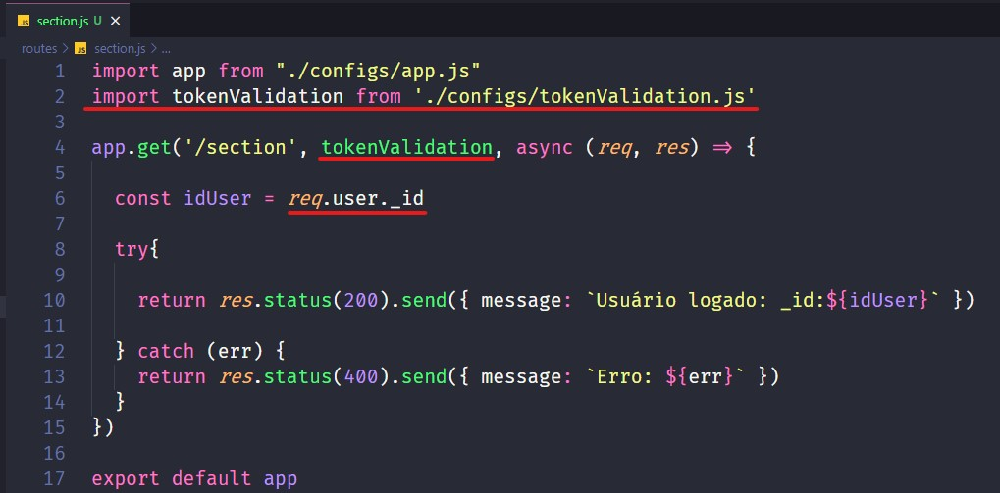
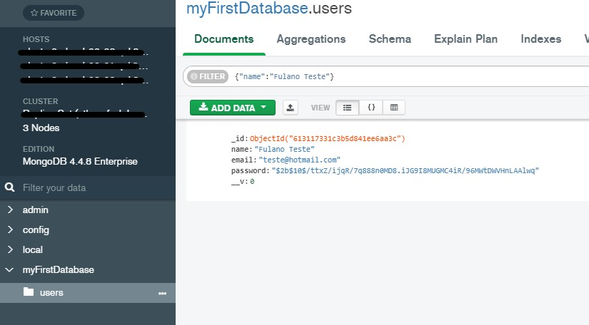

# Sistema de Cadastro e Login Back-end com NodeJS!

Este repositório contém toda parte de registro e login prontas no back-end, irei ensinar como testar cada rota, como permitir que um usuário acesse determinada rota apenas se estiver logado, e posteriormente você apenas precisará fazer a integração com o front-end. Caso alguma tecnologia utilizada adiante seja divergente com o que esteja trabalhando basta remover ou adaptar, caso tenha alguma dúvida pode entrar em contato comigo.  
Após clonar este repositório rode o seguinte comando em seu terminal:  

**npm i**

Ele fará a instalação das dependências que utilizaremos em nosso projeto.  
Após concluir o processo de instalação crie um arquivo chamado .env na raiz do projeto e preencha ele conforme indicado no arquivo .env.sample que se localiza na raiz do projeto, depois disso basta iniciarmos nosso servidor rodando o seguinte comando no terminal:  

**npm start**

## Cadastro de usuário

O banco de dados utilizado será o MongoDB, aqui gravo apenas o nome, e-mail e senha do usuário. Bibliotecas utilizadas:  

- bcrypt: para criptografar a senha ao salvar no banco  
- yup: para validar os dados do usuário, dados esses que viram de um formulário de cadastro  

Abra o postman ou o insominia para realizar os testes de cada rota, insira os dados conforme abaixo:  

Se tudo estiver ok, a mensagem “Cadastro realizado com sucesso!” será exibida em seu retorno, lembre-se de testar todas validações realizadas com o yup em cada campo enviado no body, como e-mails inválidos ou campos com caracteres inferiores a quantia obrigatória.  

## Login

Após acessar a rota de login e inserir as informações corretamente a mensagem “Login realizado com sucesso” será exibida, caso isso ocorra, um token JWT será gerado através da biblioteca jsonwebtoken, com ele conseguimos controlar o tempo em que o usuário permanece no logado no sistema, após a expiração desse token ele precisa fazer o login novamente, e com esse token conseguiremos limitar determinadas páginas em nosso sistema onde o usuário só terá acesso se estiver logado.  

Para encontrar esse token precisamos clicar na aba Headers da nossa resposta do serviço, aqui ele é chamado de auth-token, dando um duplo clique em seu value ele será exibido inteiro, copie essa chave.  

## Limitando acesso do usuário
Criei uma rota chamada section no arquivo section.js, ela simula uma rota que só poderá ser acessada por algum usuário logado no sistema, e retorna apenas o id do usuário logado. Para garantir que uma rota esteja protegida com o JWT precisamos inserir a importação da função que verifica essa validação do token, conforme linha 2, e chamar essa função onde sua rota estiver declarada, conforme linha 4.  

Na linha 6 ele recebe o id do usuário logado, o seu token JWT é passado pelo Header, na integração com o front-end, ao chamar essa rota seja por meio do axios ou um fetch, ele envia o token e com isso é possível ter acesso ao id da pessoa logada, no postman precisamos passar ele no Header conforme imagem abaixo:  

Na última linha do Headers escreva auth-token e cole o token que acabou de copiar da rota de login, se o token ainda não estiver expirado será retornado a mensagem com o id do usuário logado. Caso o usuário não esteja logado essa página não conseguirá ser acessada, podemos seguir o procedimento da linha 2 e 4 do section.js em todo serviço que o usuário só pode acessar após estar logado.  
Agora abra seu banco de dados e verifique se o id exibido é o mesmo que está cadastrado:  

Estando logado e obtendo seus dados no banco podemos fazer inúmeras coisas, aqui realmente o céu é o limite, acredito que está seja a base para qualquer sistema hoje em dia, pois a grande maioria precisa de um cadastro de usuários e login. Espero que consiga adquirir o máximo de conhecimento sobre este material, após testar todas rotas no postman é só fazer a integração com o front-end e tudo certo =D
